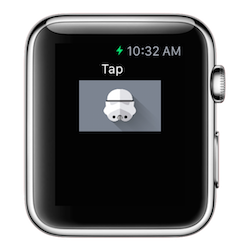
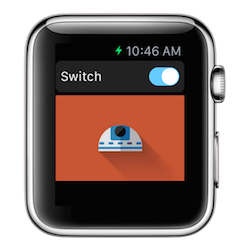
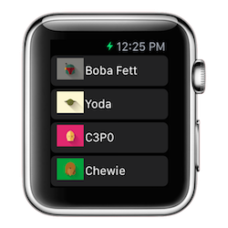

# ios-watchkit-snippets

###Description
Code snippets using WatchKit for making Apple Watch Apps.

###Project: HelloWatch

* A Simple 'Hello World' Apple Watch app.
* To run the Apple Watch app in the Simulator, simply choose the 'WatchKit App' target.
* Once the iPhone simulator is running, you may also need to navigate to __iOS Simulator--> Hardware --> External Displays --> Apple Watch__.

###Project: WatchButton

* IBOutlet for dynamically updating label. 
* IBAction for handling button tap event.
* Using image asset for button.

###Project: WatchImage

* IBOutlet for dynamically setting Image.
* IBAction for handling Switch event.

Shout out to [Filipe de Carvalho](https://www.behance.net/gallery/17998561/Star-Wars-Long-Shadow-Flat-Design-Icons) for the awesome art work!

###Project: WatchTable

* Adding a Table to the Interface.storyboard.
* Creating a row 'template' with an image and a label.
* Creating a TableRowController class in the WatchKit Extension target.
* Using the Identity Inspector to explicitly declare the TableRowController to be used by the Interface.storyboard.
* Populating table rows based on a Collection of Dictionaries.

###Deploying to your Apple Watch for Testing
To run an Xcode project on your Apple Watch, do the following:

* Connect your iOS device to your Mac.
* In Xcode, go to __Window__ --> __Devices__ and confirm that Xcode recognizes that your Apple Watch is paired with your iPhone device (see screenshot below)

* Choose the 'WatchKit App' target and your device to run. 
* Test the app on your watch!
* To remove your app from your Apple Watch, use the Apple Watch App on your IPhone to not show it.  To remove the app from both the Apple Watch and iPhone, simply delete the app from your iPhone.

