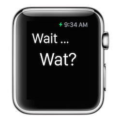
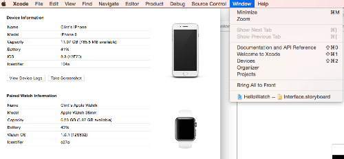

# ios-watchkit-snippets

###Description
Code snippets using WatchKit for making Apple Watch Apps.

###Project: HelloWatch

* A Simple 'Hello World' Apple Watch app.
* To run the Apple Watch app in the Simulator, simply choose the 'WatchKit App' target.
* Once the iPhone simulator is running, you may also need to navigate to __iOS Simulator--> Hardware --> External Displays --> Apple Watch__.

###Project: WatchButton
* IBOutlet for dynamically updating label text. 
* IBAction for handling button tap event.

###Project: WatchImage
* IBOutlet for dynamically setting Image.
* IBAction for handling Switch event.

###Deploying to your Apple Watch
To run an on your Apple Watch, do the following:

* Connect your iOS device to your Mac.
* In Xcode, go to __Window__ --> __Devices__ and confirm that Xcode recognizes that your Apple Watch is paired with your iPhone device (see screenshot below)

* Choose the 'WatchKit App' target and your device to run.
* To remove your app from your Apple Watch, use the Apple Watch App on your IPhone to not show it.  To remove the app from both the Apple Watch and iPhone, simply delete the app from your iPhone.

###Project: WatchTable

